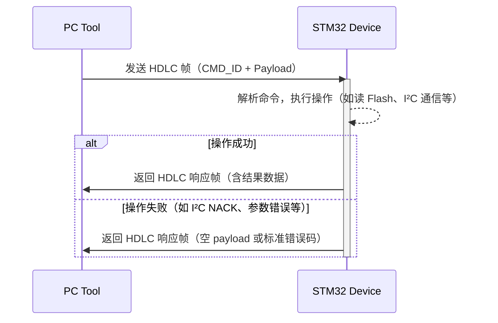

# STM32 与 PC 工具通信协议规范（HDLC 封装）

> **目的**：定义 PC 端工具通过串口向 STM32 发送命令、STM32 执行操作并返回结果的标准化通信协议。  
> **底层封装**：采用 HDLC-like 帧格式，基于 `0x7E` 标志位，支持字节转义和 CRC16-CCITT 校验，确保数据可靠传输。

---

## 一、帧结构（HDLC 封装）

所有命令请求与响应均须遵循以下统一帧格式：

### HDLC 帧结构（字节布局）

| 字段                | 长度（字节） | 说明 |
|---------------------|--------------|------|
| `FLAG_START`        | 1            | 起始标志：固定为 `0x7E` |
| `CMD_ID + Payload`  | ≥2           | 命令 ID（2 字节，大端序） + 有效载荷（0 或更多字节） |
| `CRC16`             | 2            | 对 `[CMD_ID + Payload]` 计算的 CRC16-CCITT 校验值（大端序） |
| `FLAG_END`          | 1            | 结束标志：固定为 `0x7E` |

> ✅ **最小帧长度** = 1（起始） + 2（CMD_ID） + 0（Payload） + 2（CRC） + 1（结束） = **6 字节**

### 关键细节

- **CMD_ID**：2 字节，大端序（Big-Endian）
- **Payload**：命令参数（请求）或返回数据（响应）
- **CRC16 算法**：
  - 多项式：`0x1021`
  - 初始值：`0xFFFF`
  - 输入/输出不反转
  - 仅对 `[CMD_ID + Payload]` 计算
- **字节转义规则（发送前 / 接收后需处理）**：
  - `0x7E` → 转义为 `0x7D 0x5E`
  - `0x7D` → 转义为 `0x7D 0x5D`
  - 接收端必须进行反向解码（去转义）

> 📌 **示例**：发送命令 `CMD_FLASH_READ = 0x0101`，无参数  
> - 原始内容：`[0x01, 0x01]`  
> - CRC16(0x0101) = `0x1234`（假设值）  
> - 转义后（若无特殊字节）：`7E 01 01 12 34 7E`

---

## 二、命令列表（PC → STM32）

| CMD_ID (Hex) | 命令名称                 | Payload（请求参数）                              | 功能说明                     |
|--------------|--------------------------|--------------------------------------------------|------------------------------|
| `0x0101`     | `CMD_FLASH_READ`         | `4 字节起始地址 + 2 字节读取长度`                | 读取内部 Flash 数据          |
| `0x0201`     | `CMD_I2C_READ_REG`       | `1 字节设备地址 + 1 字节寄存器地址`              | I²C 读单字节寄存器           |
| `0x0202`     | `CMD_I2C_16READ_REG`     | `1 字节设备地址 + 2 字节寄存器地址（大端序）`    | I²C 读 16 位寄存器地址       |
| `0x0221`     | `CMD_I2C_WRITE_REG`      | `1 字节设备地址 + 1 字节寄存器地址 + 1 字节值`   | I²C 写单字节寄存器           |
| `0x0222`     | `CMD_I2C_16WRITE_REG`    | `1 字节设备地址 + 2 字节寄存器地址 + 1 字节值`   | I²C 写 16 位寄存器地址       |
| `0x0301`     | `CMD_SPI_READ_REG`       | `1 字节寄存器地址`                               | SPI 读单字节寄存器           |
| `0x0302`     | `CMD_SPI_WRITE_REG`      | `1 字节寄存器地址 + 1 字节值`                    | SPI 写单字节寄存器           |

> 💡 **注意**：
> - 所有数值（地址、长度、寄存器值等）均使用 **大端序（Big-Endian）**
> - Payload 长度必须严格匹配命令定义，否则视为无效帧

---

## 三、响应格式（STM32 → PC）

每个请求命令必须对应一个响应帧，即使操作失败也需返回有效 HDLC 帧以维持通信状态。

| 请求 CMD_ID | 响应 CMD_ID (Hex) | 响应名称                        | Payload（响应数据）                  | 说明 |
|-------------|-------------------|----------------------------------|--------------------------------------|------|
| `0x0101`    | `0x0102`          | `CMD_FLASH_READ_RESULT`         | `N 字节原始 Flash 数据`              | N = 请求中指定的长度 |
| `0x0201`    | `0x0210`          | `CMD_I2C_READ_RESULT`           | `1 字节读取值`                       | 若失败，可返回空 payload 或错误码 |
| `0x0202`    | `0x0210`          | `CMD_I2C_READ_RESULT`           | `1 字节读取值`                       | 同上 |
| `0x0221`    | `0x0230`          | `CMD_I2C_WRITE_ACK`             | （可选，通常为空）                   | 表示写入成功 |
| `0x0222`    | `0x0230`          | `CMD_I2C_WRITE_ACK`             | （可选）                             | 表示写入成功 |
| `0x0301`    | `0x0303`          | `CMD_SPI_READ_RESULT`           | `1 字节读取值`                       | —— |
| `0x0302`    | `0x0304`          | `CMD_SPI_WRITE_ACK`             | （可选）                             | —— |

> ⚠️ **重要**：  
> - **禁止静默丢弃请求**。若操作失败（如 I²C 无 ACK、Flash 地址越界等），STM32 必须返回一个合法 HDLC 帧（可含错误码或空 payload）。  
> - PC 端依赖完整帧判断设备在线状态，缺失响应将导致“设备断开”误判。

---

## 四、通信流程

---

## 五、附录：推荐实现建议

- **STM32 端**：
  - 使用环形缓冲区接收串口数据，逐字节检测 `0x7E` 并处理转义。
  - 收到完整帧后验证 CRC，校验失败则丢弃（不响应）。
  - 所有响应应在合理时限内发出（建议 ≤ 100ms）。
- **PC 端**：
  - 实现超时机制（如 500ms），超时未收到响应视为通信异常。
  - 自动重试机制（可选）适用于关键命令。
- **调试建议**：
  - 提供原始帧日志（含转义前后对比）便于排查。
  - 支持 CRC 校验开关，用于协议调试阶段。

---

> ✅ 本协议设计兼顾 **可靠性**、**简洁性** 与 **可扩展性**，适用于嵌入式设备与上位机工具间的稳定通信场景。
